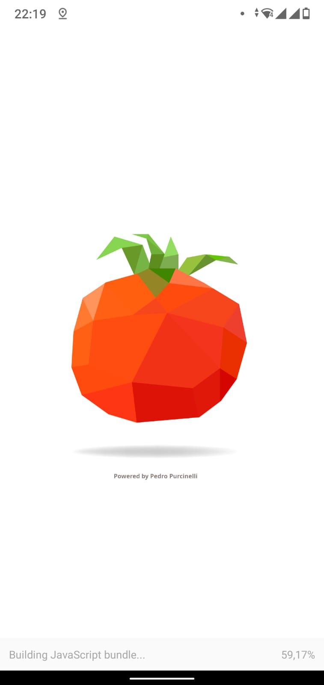

# Pomodoro APP
The Pomodoro Technique is a time management method developed by Francesco Cirillo in the late 1980s. The technique uses a timer to break down work into intervals, traditionally 25 minutes in length, separated by short breaks.

-------------------------------------------------------------------------------------------------

That's My first React Native "real" Project, where I am using technologies I'm learning at the moment.
At the moment I am using JS with some technogies like;
   React Native, Redux, Node,  Babel, ...
   Will use this app to learn and introduce my new skills to a real world project.
   
   I'm leading the project. And the main objective of this is, for this app to become a certain timelime of my habilities, since i'm a junior developer right now. 
    Allowing, not only to learn with my own code,  but to show my improvements on the market and for the Network.

    If you'd like to participate in this project, have any suggestions, recommendations, review or just wanna talk. Feel free to contact me.
It's nice to have good friends aswell.

## Execute the app:

This is an app developed in the React Native language.
Since it is an app made for mobiles, I am using the expo client!
  ------(Will be providing an external link soon)------

1. Install `expo-cli` globally with NPM or Yarn;
2. `git clone`  this repository;
3. Acess the repository and execut `yarn` to install dependencies;
4. Execute `yarn start` for Expo
5. Smartphone app of Expo or Expo Client
6. QRCode
7. Enjoy it

**App under development**

----------------------------------------------------------------------------------------------------------------------------------------

Next Updates coming soon: 

  -Schedule  (Activly coding)
  - New feature that will allow the user to create a ToDo item or list. (Next feature)
  
  - Alarm
  - Reminder
  - NotePad
  - New app design
  - New Images
  - Some interaction with `Spotify`
  - Who knows?...

